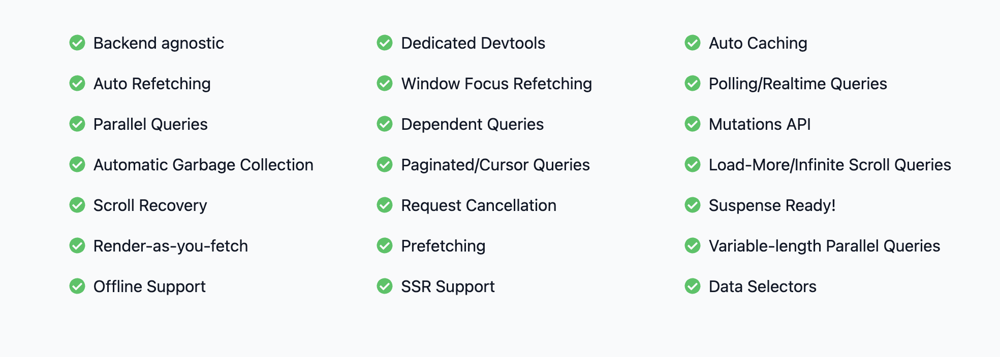

# React Query


In React, managing state is a crucial aspect of building efficient and scalable applications. Two types of state exist in React applications: server state and client state.

- Server State

Server state refers to the data fetched from an API or a backend server. This data is not yet processed or manipulated by the client-side code. When working with server state, it is essential to handle asynchronous data fetching and caching to ensure a smooth user experience.

TanStack Query (formerly React Query) is a popular library for managing server state in React applications. It is efficient and makes the UI smooth on the client side. With TanStack Query, components will only re-render when the data that they need has been fetched.

```jsx
import { useQuery } from "react-query";

const fetchPosts = async () => {
  const response = await fetch("https://api.example.com/posts");
  return response.json();
};

const Posts = () => {
  const { data, isLoading, error } = useQuery("posts", fetchPosts);

  if (isLoading) return <div>Loading...</div>;
  if (error) return <div>Error: {error.message}</div>;

  return (
    <ul>
      {data.map((post) => (
        <li key={post.id}>{post.title}</li>
      ))}
    </ul>
  );
};
```

- Client State

Client state refers to the data that is specific to the client-side and is not dependent on server data. This includes UI state, form data, and other ephemeral information.

In React, you can manage client state using built-in hooks like useState and useReducer, or use state management libraries like Redux.

```jsx
import React, { useState } from "react";

const Counter = () => {
  const [count, setCount] = useState(0);

  const handleClick = () => {
    setCount(count + 1);
  };

  return (
    <div>
      <button onClick={handleClick}>Increment counter</button>
      <div>Counter value: {count}</div>
    </div>
  );
};
```

Data fetching is an essential part of any modern web application. It allows us to retrieve data from APIs and other sources to display it to the user. In a React application, many different libraries and techniques can be used to manage data fetching.

## Server state manager libraries

- ReactQuery

  - React-Query is a comprehensive data-fetching library that focuses on providing a powerful and flexible solution for managing data in React applications.
  - It offers features like caching, pagination, background data synchronization, optimistic updates, and more.
  - React-Query utilizes a query-based approach where you define queries for fetching data and handle the state of those queries using hooks.

- SWR (Stale While Revalidate)
  - SWR is a lightweight library that focuses on providing a simple and fast solution for data fetching and synchronization.
  - It emphasizes real-time updates and automatic revalidation of data by leveraging stale-while-revalidate caching strategy.
  - SWR uses a hook-based approach similar to React-Query and provides an easy-to-use API.

### Top benefits

- fetching
- caching
- updating

### Difference between "Reac-Query" and "SWR"

One of the main differences between the two libraries is the level of features and functionality they provide.

React-Query is a more feature-rich and powerful library. It provides advanced caching, background data synchronization, and various data management capabilities. It is suitable for complex enterprise projects where data management requirements are high.

SWR, on the other hand, is a lightweight library focused on simplicity and speed. It is well-suited for small to medium-sized projects that require real-time updates and simple data fetching with a low learning curve.

|          Feature          |     React-Query      |         SWR          |
| :-----------------------: | :------------------: | :------------------: |
|         Approach          |     Query-based      |      Hook-based      |
|          Caching          |         Yes          |         Yes          |
|   Data synchronization    |         Yes          |         Yes          |
| Real-time synchronization |         Yes          |         Yes          |
|        Pagination         |         Yes          | Manual implemenation |
| Background data fetching  |         Yes          |          No          |
|    Optimistic updates     |         Yes          |          No          |
|   Server-side rendering   |         Yes          |         Yes          |
|    Typescript support     |         Yes          |         Yes          |
|         Ecosystem         | Mature and extensive |     Lightweight      |
|      Learning curve       |       Moderate       |         Low          |
|           Size            |        Larger        |       Smaller        |
|     Community support     |        Strong        |       Growing        |

## Why use ReactQuery



## Why not use ReactQuery

No Idea

## React Query benefits for our project
All of the above + transformers

## Challenges of integrating ReactQuery into the DK project

- getServerSidePropsWrapper
- createPage

- apiRequestObject 
- API Handler
- useSSR
- useAPI
- usePageData
- useFilter
- useData

## Feasibility

## Conclusion
